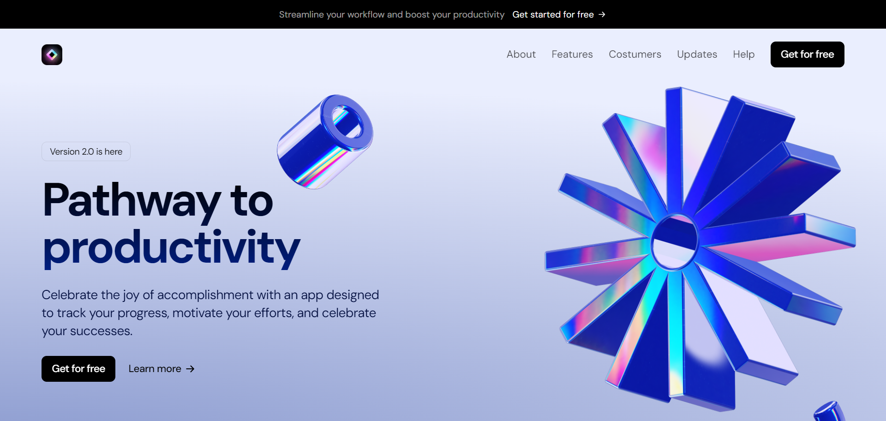
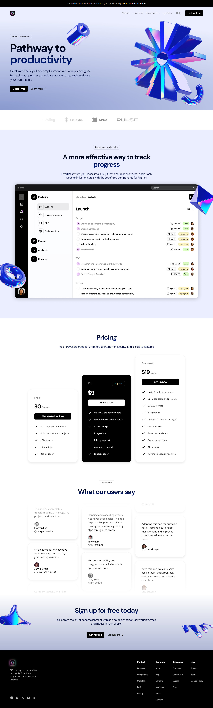

This project was created to practice my skills in developing beautiful interfaces with a focus on good UI/UX design. I used Next.js, Tailwind CSS, and Framer Motion to build this project.

## Installation

To see my project, you'll need to clone this repository and open it manually. Follow the steps below:

1. Clone the repository:
```bash
git clone <repository-url>

```
2. Navigate to the repository:
```bash
cd <project-directory>
```

3. Install the dependencies:
```bash
npm install
```

4. Run the development server::
```bash
npm run dev
```

5. Open your browser and go to http://localhost:3000 to see the project.

<hr>

### Acknowledgments

I want to extend my appreciation to the creator of the video tutorial that guided me through this project. Here, you can see the
[Video Tutorial](https://www.youtube.com/watch?v=7hi5zwO75yc)  and 
[Figma Design](https://www.figma.com/design/mM6yPn9XZPLf4vXOkQwskl/SaaS-Website-UI-Kit-%E2%80%94-Framer-Website-Kit-(Community)?node-id=14-576&t=HIAA4aQijKXQSuaK-0).

<hr>


### Landing Page Preview
Here's a preview of the landing page I created:

